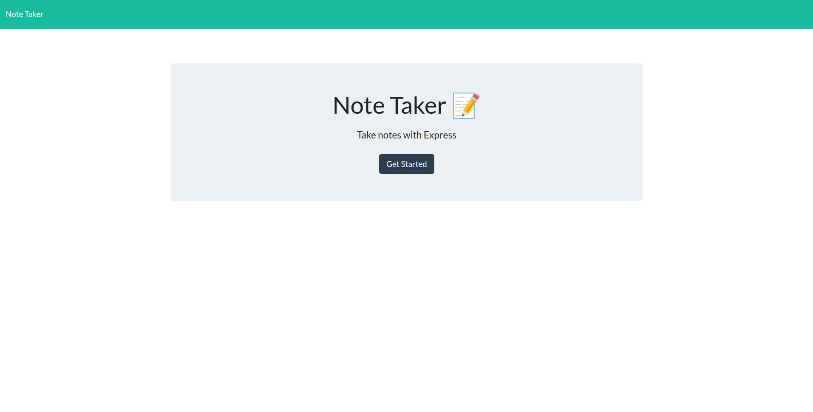

# Note Taker
   

  ## Table of Contents
  
  [Description](#description)

  [Installation Instructions](#installation)

  [Usage Info](#usage)

  [Links](#links)

  [Contribute](#contribute)

  [Tests](#tests)

  [License](#license)

  [Credits](#credits)

  [Questions](#questions)
  

  
  ## Description
Note Taker is a simple note taking application.  You can add or delete notes.

  ## Installation
git clone https://github.com/odisclemons/11-note-taker

cd 11-note-taker

yarn start

  ## Usage
Note Taker is very simple to use.  Just click the + icon at the upper right-hand corner.  This will allow you to create a new note.  After that, fill in the note title and description.  Finally you can click the save icon.  Note: you cannot save a note until both fields are filled in.

## Click the image below to watch a usage demo.

## Links
[Heroku: https://odis-11-note-taker.herokuapp.com/](https://odis-11-note-taker.herokuapp.com/)

[Github: https://github.com/odisclemons/11-note-taker](https://github.com/odisclemons/11-note-taker)

  ## Contribute
Send me a pull request on this project and you can contribute if your code is approved.

  ## Tests
There are no tests available for this app.

  ## License

Copyright (c) 2022 Odis Clemons odis.clemons@gmail.com Licensed under the [MIT](https://api.github.com/licenses/mit) license.

  ## Credits
This app was creatd by Odis Clemons.

  ## Questions
For any questions you may have, please contact Odis Clemons at [odis.clemons@gmail.com](mailto://odis.clemons@gmail.com), or on Github at [https://github.com/odisclemons](https://github.com/odisclemons)
  